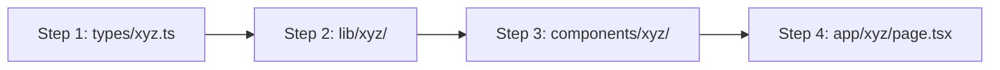

# Gaurav Portfolio: Complete Architecture, Technical Blueprint & Change Log

This document serves as the master architectural reference, codebase study guide, and operational history for **Gaurav Portfolio**.

---

## 1. Core Principles & Governance Rules

1. **Official Project Name**: Strictly **Gaurav Portfolio**. Terms like "devlab", "devlabs", "shiro", or "kuro" are prohibited in user-facing code, comments, documentation, and metadata.
2. **Main Portfolio UI/UX Preservation**: Signature dark modern glassmorphism design tokens (`#000319`, `#CBACF9`, `#C1C2D3`), ambient spotlights, 3D WebGL canvases, and original portfolio typography must remain 100% consistent across all portfolio routes (`/`, `/privacy`, `/terms`).
3. **Scroll-Spy & URL Synchronization**: `FloatingNav.tsx` and `hooks/use-scroll-spy.ts` synchronize URL anchors dynamically with DOM section IDs (`#about`, `#projects`, `#testimonials`, `#contact`).
4. **Dev Server Stability**: WebGL and Three.js canvases are isolated in `next/dynamic(..., { ssr: false })` with Webpack polling and transpilation in `next.config.ts`.
5. **Data Access Layer (DAL) Architecture**: All data fetching and backend integrations are mediated through `lib/` modules (e.g. `lib/admin/`, `lib/contact/`) to allow seamless database/API swaps without altering UI components.
6. **Strict Admin Subsystem Isolation**: Scoped strictly to `app/admin/`, `components/admin/`, `lib/admin/` with the minimalist Swiss light system (`#FFFFFF`, `#FAFAFA`, `#000000`, `#64748B`, `#E5E7EB`) and fonts (`font-admin-sans`, `font-admin-mono`) scoped inside `app/admin/layout.tsx` with **zero global CSS bleed**.
7. **No Commit/Push Rule**: Never execute `git commit` or `git push` without explicit user permission.
8. **No Routine Production Build Checks**: Never execute `npm run build` automatically during routine dev edits. Only run when explicitly instructed.
9. **No Unsanctioned Background Schedulers or Cron Jobs**: Never create, configure, or deploy any automated background cron jobs, Cloud Schedulers, Cloud Functions, background worker tasks, periodic pollers, or visitor ban/unban logic without explicit, exclusive permission from the user.
10. **Isolated Component Skeleton Loaders & Progressive Streaming**: Every dynamic or below-the-fold component/section must declare its own dedicated skeleton loader in `next/dynamic` (`loading: () => <SectionSkeleton />`) and `AdaptiveLazySection` (`placeholder={<SectionSkeleton />}`). If a single heavy module or 3D canvas is delayed over the network, it must stream and load independently without blocking, freezing, or delaying the rest of the portfolio, ensuring zero Cumulative Layout Shift (CLS = 0).


---

## 2. Domain-Driven Enterprise Architecture

```
c:\github\devlabs
├── .agents/                        <- Governance rules & architectural notes
│   ├── AGENTS.md                   <- Master rules file
│   ├── notes/
│   │   └── architecture_and_changes_summary.md <- This study & reference guide
│   └── rules/
│       ├── admin_panel_design_system.md
│       └── scroll_sync_and_navigation.md
│
├── app/                            <- [Layer 1: Routing & Composition Only]
│   ├── page.tsx                    <- Home route composing portfolio feature blocks
│   ├── layout.tsx                  <- Root layout (dark glassmorphism theme)
│   ├── privacy/page.tsx            <- Legal privacy policy
│   ├── terms/page.tsx              <- Legal terms of service
│   ├── global-error.tsx            <- Global error boundary
│   ├── not-found.tsx               <- 404 handler
│   ├── admin/                      <- Admin Subsystem (isolated Swiss light theme)
│   │   ├── layout.tsx              <- Scoped admin fonts & theme variables
│   │   ├── page.tsx                <- Admin overview dashboard (inbound inquiries)
│   │   └── login/page.tsx          <- Pure Google OAuth sign-in (gauravpatil9262)
│   └── api/                        <- Serverless Route Handlers
│       ├── contact/route.ts        <- Contact submission handler
│       └── admin/auth/
│           ├── login/route.ts      <- Google OAuth admin login verification
│           └── session/route.ts    <- Session status and signout
│
├── components/                     <- [Layer 2: Presentation & Component Domains]
│   ├── ui/                         <- Atomic Design Primitives
│   │   ├── 3d-pin.tsx              <- 3D Pin perspective card
│   │   ├── BentoGrid.tsx           <- Responsive Bento Grid container & items
│   │   ├── CanvasRevealEffect.tsx  <- WebGL shader dot canvas
│   │   ├── FloatingNav.tsx         <- Glassmorphism floating navbar
│   │   ├── Globe.tsx               <- Three.js 3D Earth visualization
│   │   ├── GridGlobe.tsx           <- Bento item with embedded 3D Globe
│   │   ├── InfiniteMovingCards.tsx <- Auto-scrolling horizontal cards with hover-pause
│   │   ├── MagicButton.tsx         <- Animated border gradient action button
│   │   ├── MovingBorders.tsx       <- SVG animated border card wrapper
│   │   ├── RouteProgressBar.tsx    <- Top navigation progress indicator
│   │   ├── ScrollToTop.tsx         <- Smooth scroll-to-top button
│   │   ├── Spotlight.tsx           <- Ambient conic spotlight shader
│   │   └── TextGenerateEffect.tsx  <- Typewriter / text generation effect
│   ├── portfolio/                  <- Main Portfolio Section Modules
│   │   ├── HeroSection.tsx         <- Hero fold with spotlight & typewriter
│   │   ├── GridSection.tsx         <- Bento grid layout
│   │   ├── ProjectsSection.tsx     <- Project showcase with 3D pins
│   │   ├── TestimonialsSection.tsx <- Client testimonials with InfiniteMovingCards
│   │   ├── ExperienceSection.tsx   <- Career timeline cards with MovingBorders
│   │   ├── ApproachSection.tsx     <- 3-phase methodology with CanvasRevealEffect
│   │   ├── FooterSection.tsx       <- Call to action, legal links & contact modal trigger
│   │   └── index.ts                <- Barrel export
│   ├── admin/                      <- Admin Console UI Modules (Domain-Driven Slices)
│   │   ├── navigation/             <- AdminHeader & AdminSidebar
│   │   ├── profile/                <- AdminProfileCard & AdminProfileModal
│   │   ├── overview/               <- OverviewCanvas workspace
│   │   ├── auth/                   <- AdminLoginForm & feedback states
│   │   ├── skeletons/              <- AdminOverviewSkeleton & AdminSidebarSkeleton
│   │   └── index.ts                <- Unified admin barrel export
│   └── contact/                    <- Contact Subsystem UI Modules
│       └── ContactModal.tsx        <- Interactive contact form dialog
│
├── lib/                            <- [Layer 3: Core Logic & Data Access Layer (DAL)]
│   ├── admin/                      <- Admin domain logic & Firebase SDKs
│   │   ├── auth.ts                 <- Admin identity validator (gauravpatil9262)
│   │   ├── constants.ts            <- Primary admin constants
│   │   ├── firebase.ts             <- Lazy SSR-safe client singleton
│   │   ├── firebase-admin.ts       <- Modular Firebase Admin SDK
│   │   └── session.ts              <- NextRequest cookie validation
│   ├── contact/                    <- Contact domain logic
│   │   ├── emailjs-contact.ts      <- EmailJS transactional relay
│   │   └── profanity-filter.ts     <- Input sanitization pipeline
│   ├── security/                   <- Security & verification domain
│   │   └── turnstile.ts            <- Cloudflare Turnstile verification
│   └── utils.ts                    <- Tailwind merge (`cn`) & shared utility functions
│
├── types/                          <- [Layer 4: TypeScript Contracts & Schemas]
│   ├── index.ts                    <- Unified type exports
│   ├── portfolio.ts                <- Projects, testimonials, experience contracts
│   ├── admin.ts                    <- Admin session, metrics, dashboard contracts
│   └── contact.ts                  <- Contact form payload & API response types
│
├── hooks/                          <- [Layer 5: Reusable React Hooks]
│   ├── use-scroll-spy.ts           <- Viewport tracking & URL synchronizer
│   └── index.ts                    <- Barrel export
│
└── data/                           <- [Layer 6: Static Datasets & Assets]
    ├── index.ts                    <- Typed portfolio static datasets
    ├── globe.json                  <- Geospatial points for 3D Earth
    └── confetti.json               <- Animation Lottie payload
```

---

## 3. Subsystem Deep-Dive

### A. Main Portfolio Subsystem
- **Design Tokens**: Dark glassmorphism (`#000319`, `#CBACF9`, `#C1C2D3`), ambient spotlights, 3D WebGL canvases.
- **Section Lazy-Loading**: Below-the-fold sections (`GridSection`, `ProjectsSection`, `TestimonialsSection`, `ExperienceSection`, `ApproachSection`, `FooterSection`) are wrapped in `AdaptiveLazySection` and `next/dynamic(..., { ssr: false })` for instant First Contentful Paint.
- **Infinite Moving Cards**:
  - Horizontal seamless scrolling using `@keyframes scroll { to { transform: translate(calc(-50% - 0.5rem)); } }`.
  - Automatically pauses when the cursor hovers over any card (`hover:[animation-play-state:paused]`).

### B. Admin Subsystem (`/admin/*`)
- **Visual Identity**: Minimalist Swiss light system (`#FFFFFF`, `#FAFAFA`, `#000000`, `#64748B`, `#E5E7EB`).
- **Dynamic Route Gatekeeping ([`middleware.ts`](file:///c:/github/devlabs/middleware.ts))**:
  - Unauthenticated requests to `/admin` redirect to `/admin/login`.
  - Authenticated sessions visiting `/admin/login` redirect directly to `/admin`.
- **Single-Admin Authentication**:
  - Pure single-action **`CONTINUE WITH GOOGLE`** button via `signInWithPopup(getFirebaseAuth(), getGoogleProvider())`.
  - Identity strictly verified against `gauravpatil9262` (`gauravpatil9262@gmail.com`).
  - Unauthorized accounts receive clean error feedback: *"Access Denied: You are not authorized to access this administrator console."*
  - Zero public credentials or spoilers displayed on the login page.
- **Dashboard Telemetry**:
  - Live inbound contact submissions stream directly from Firebase Realtime Database into the overview table.

### C. Contact & Security Pipeline
- **Cloudflare Turnstile**: Zero-gap bot and captcha protection.
- **EmailJS Dual Pipeline**: Dispatches lead briefs to admin and confirmation notices to visitors.
- **Profanity Sanitization**: Real-time dictionary scanning before persistence.
- **Realtime Database**: Inquiries saved directly under `/messages` node in Firebase RTDB (`asia-southeast1`).

---

## 4. Diagnostics & Maintenance History

1. **Rollback to Clean Baseline (v0.0.1)**:
   - Purged over 17,000 lines of legacy admin/blog/visitor-tracking bloat.
   - Cleaned dependencies and locked versions.
2. **Infinite Moving Cards Keyframe Fix**:
   - Diagnosed missing `@keyframes scroll` in Tailwind configuration.
   - Added keyframes to `tailwind.config.ts` and `app/globals.css`.
3. **Firebase Admin Modular Import Fix**:
   - Updated `lib/admin/firebase-admin.ts` to modern subpath modular imports (`firebase-admin/app`, `firebase-admin/firestore`, `firebase-admin/database`), resolving Vercel compilation errors.
4. **Ghost Cloud Scheduler Diagnosis & Elimination**:
   - Traced recurring 1-minute `admin_audit_logs` entries to Google Cloud Scheduler job `firebase-schedule-autoUnbanScheduler-us-central1` hitting a legacy Cloud Run endpoint.
   - Deleted the Cloud Scheduler job in Google Cloud Console and permanently banned unsanctioned schedulers via **Rule 9**.
5. **Cross-Platform Cache Scripts (`package.json`)**:
   - `npm run clear`: Deletes `.next` build cache via Node.js `fs.rmSync`.
   - `npm run clean`: Deletes both `node_modules` and `.next`.
   - `npm run dev:clear`: Clears `.next` and boots `next dev --turbo`.
   - `npm run dev:clean`: Deep clean, reinstalls packages, and boots `next dev --turbo`.
6. **Direct Google OAuth 2.0 PKCE Authentication & Zero-Residual Lifecycle**:
   - Implemented standard RFC 7636 PKCE flow (`app/api/admin/auth/google/route.ts` & `app/api/admin/auth/callback/route.ts`), completely eliminating secondary floating popup windows with 100% in-tab navigation.
   - Dynamic account chooser (`prompt: "select_account"`) dynamically presenting all available Google accounts on the user's browser.
   - Strict Superadmin authorization enforcement (`isAuthorizedAdminEmail`), routing unauthorized accounts to clean, privacy-preserving Swiss Access Denied alerts.
   - Dynamic Google User Profile Picture & Display Name extraction from `userinfo`, replacing all static placeholder fallbacks.
   - Distinct loader architecture: Full-card multi-stage progress loader (`AdminPanelLoader.tsx`) for login transitions, zero-residual enterprise sign-out overlay (`SignOutOverlay.tsx`), and non-blocking 2px neon top progress line + glass sync indicator in `AdminHeader.tsx` during live telemetry sync.

---

## 5. Future Scalability Blueprint: How to Add ANY Feature (XYZ)

When expanding the portfolio in the future with new features (e.g. **Hero V2**, **Blog System**, **Project CMS**, **Subscribers/Newsletter**, **Store**), follow this 4-step plug-and-play pattern:



### Adding Variant Components (e.g., `HeroV2Section`):
1. Create `components/portfolio/HeroV2Section.tsx`.
2. Export from `components/portfolio/index.ts`.
3. In `app/page.tsx`, simply import `<HeroV2Section />` and place it inside an `<AdaptiveLazySection>`.

### Adding External Microservices & Live APIs:
1. Create `lib/microservices/xyz-service.ts` to encapsulate API calls.
2. Create custom hook `hooks/use-xyz.ts` to manage state/subscriptions.
3. Component imports the hook and renders live data without hardcoded dependencies.

---

## 6. Verification Status

- **Linting**: `npm run lint` &rarr; `✔ No ESLint warnings or errors`.
- **Type Checking**: `npx tsc --noEmit` &rarr; `0 errors`.
- **Production Build**: `npm run build` &rarr; `✓ Compiled successfully (8/8 static routes)`.
